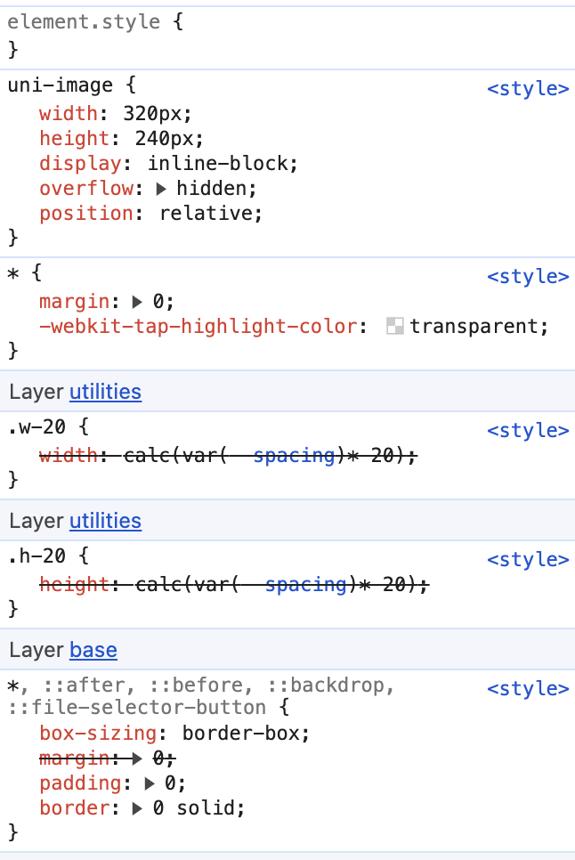

# 开发前注意!

:::warning
由于 `tailwindcss@4.x` 本身还在快速的开发迭代中，即使是小版本也可能带有一些意外的 `Breaking Change`

所以以下内容可能会经常变更，如果发现已经过时，请提 `issue` 或者直接修复提 `pr`
:::

## 定位的变化: 样式预处理器

相对于 `tailwindcss@3` 版本， `tailwindcss@4` 存在定位的重大变更

它直接变成了一个样式预处理器，和原生 `css` 已经它的规范相结合，相辅相成。

所以你在 `4.x` 版本中，不应该让 `tailwindcss` 和 `sass`,`less`,`stylus` 一起使用

详见: https://tailwindcss.com/docs/compatibility#sass-less-and-stylus

## 集成选择

`tailwindcss` 集成上提供了多种选择 (`cli`,`vite`,`postcss`)，这里我们主要选择 `@tailwindcss/postcss`，原因如下:

1. `@tailwindcss/postcss` 兼容性更好，开发打包器使用 `vite` 和 `webpack` 的都能用，而 `@tailwindcss/vite` 这里只有 `vite` 能用。
2. `@tailwindcss/vite` 很容易和其他的 `vite` 插件起冲突，尤其是和 `uni-app` / `taro` 一起使用的时候，依赖注册的顺序和编译 `hook` 注册的顺序
3. `uni-app`/`taro` 这种框架，默认都是 `cjs` 加载的，而 `@tailwindcss/vite` 只提供了 `esm` 的版本，所以集成上可能会遇到问题
4. `tailwindcss@3.x` 是 `postcss` 插件，`@tailwindcss/postcss` 也是 `postcss` 插件，所以选择它，项目迁移升级的成本会更低。

所以，综合考虑下来，我们主要选择 `@tailwindcss/postcss`。

当然，你也完全可以使用 `uni-app vite vue3` + `@tailwindcss/vite` 这种组合。从编译速度出发, `@tailwindcss/vite` 会更快，但是可能需要一些额外的配置，行为也有可能和 `tailwindcss@3.x` 不一致。

## 小程序样式引入 `tailwindcss` 不同点

在小程序的样式文件中，引入 `tailwindcss` 的时候，需要把官方文档上写的 `@import "tailwindcss"` 替换为 `@import "weapp-tailwindcss"`。

```diff
- @import "tailwindcss";
+ @import "weapp-tailwindcss";
```

### 有什么区别?

`@import "weapp-tailwindcss"` 相比 `@import "tailwindcss"` 的主要区别是:

1. `"weapp-tailwindcss"` 没有 `"tailwindcss"` 中 `h5` `preflight` 的类(这些都是给 `h5` 用的，小程序用不到)
2. `"weapp-tailwindcss"` 中，不使用 `tailwindcss` 默认的 `@layer` 来控制样式优先级。这是因为小程序本身不支持 `css` `@layer` 这个特性，强行启用会造成一些样式难以覆盖的问题。

### 多端开发

假如你需要进行多端的开发，那么可以使用对应框架的样式条件编译写法，比如 `uni-app`:

```css
/*  #ifdef  H5  */
@import "tailwindcss";
/*  #endif  */
/*  #ifndef  H5  */
@import "weapp-tailwindcss";
/*  #endif  */
```

详见 https://uniapp.dcloud.net.cn/tutorial/platform.html

## 开发 h5

`tailwindcss@4` 使用原生的 `@layer` 去控制样式的优先级

> 如果你不知道什么是 `@layer`，你可以阅读这篇文档 https://developer.mozilla.org/zh-CN/docs/Web/CSS/@layer

但是像 `uni-app` / `taro` 这种框架，默认都是直接引入很多内置样式的。

于是就会出现下方尴尬的情况: 优先级 `(0,1,0)` 的 `class` 选择器样式无法覆盖 `(0,0,1)` 的标签选择器样式:



这种情况，你就非常需要兼容性降级方案，即使用 [`postcss-preset-env`](https://www.npmjs.com/package/postcss-preset-env)

## 使用 pnpm

默认使用 `pnpm` 的时候，由于 `pnpm` 是无法使用幽灵依赖的

但是 `uni-app`/`taro` 出于一些历史原因，是需要幽灵依赖的，这时候可以在项目下创建 `.npmrc` 添加内容如下

```txt title=".npmrc"
shamefully-hoist=true
```

然后重新执行 `pnpm i` 安装包即可运行


## 智能提示

目前 `tailwindcss@4` 的 `vscode` 插件，会扫描目录下的 `css` 来获取 `tailwindcss` 的配置。

但是这里有个非常坑的点是，它不会去自动的扫描 `.vue` 文件里面的 `tailwindcss` 引入

这就导致，我们假如想在 `vue` 项目(比如 `uni-app`) 中获得智能提示，必须再随便创建一个 `main.css`，然后通过 `App.vue` 文件引入它

```css title="main.css"
@import "weapp-tailwindcss/css";
@source not "dist";
```

```html title="App.vue"
<style src="./main.css"></style>
```